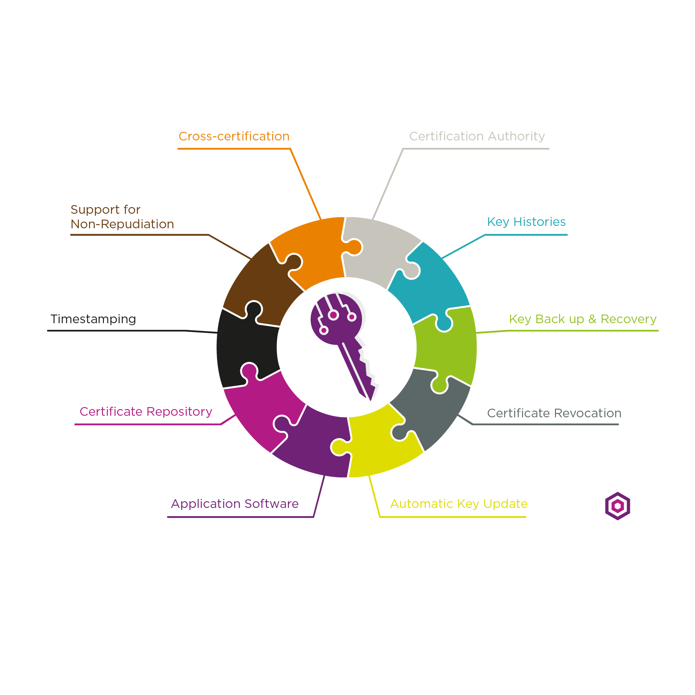
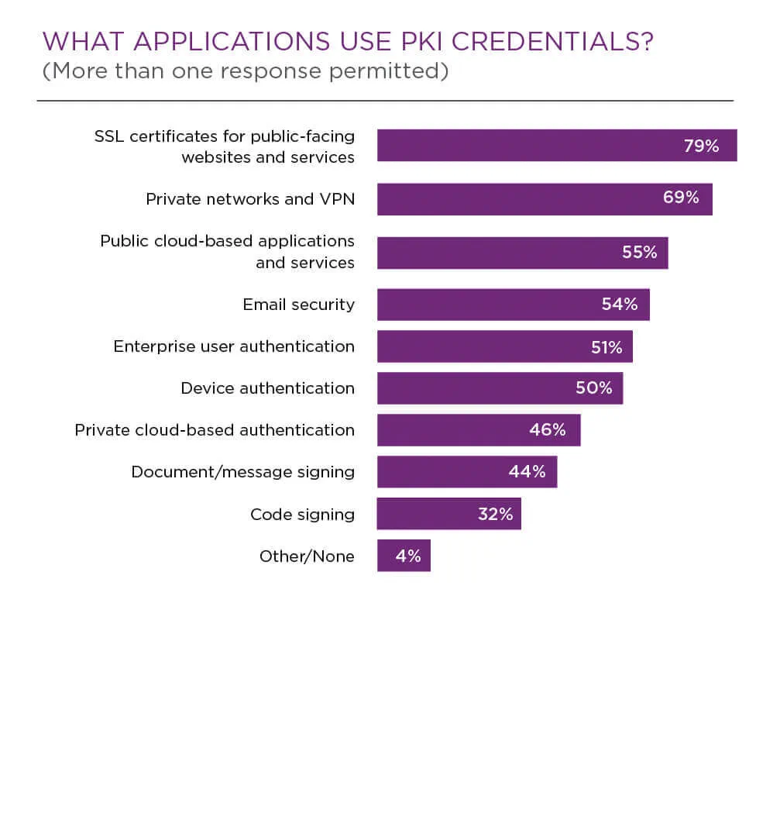

# What is PKI?

PKI is an acronym for public key infrastructure which is the technology behind digital certificates.  
PKI is the technology that allow you to encrypt data , digitally sign documents , and authenticate your self using certificates.  
An important piece of the PKI technology is the CA.

## What are the components that make up an effective public key infrastructure ?

## What is digital certificate ?

A digital certificate allows  its owner to encrypt sign and authenticate . digital certificate vouches for the holders identity . Like a driver license , the certificate has been issued by a trusted third party cannot be forged and contains identifying information .

## What is CA ?

A certificate authority is a trusted third party thats verify the identity of an organization applying for a digital certificate.
after verifying the organization identity the CA issue a certificate and binds the organizations identity to public key . 

## What is the difference between PKI and SSL ?

PKI is an entire framework thats consists of hardware , software , policies ,and  more .  
SSl is one of top use cases of PKI . it also involves CA that issue certificate , but is must recognized by browsers as a  publicly trusted ca.

## What are the common use cases for PKI ?

1. Secure web sites - HTTPS   
the most familiar use of PKI is in SSL certificates. SSL (Secure Socket Layer) is a security protocol use on the web when you fetch data a page whose address begin with https:.TLS (Transport Layer Security) is a newer version of the protocol.  
Certificates and cryptographic authentication of the server prevent man in the middle attacks.
2. Authenticating users and computer -SSH  
the SSH (Secure Shell protocol) support certificate for authenticating host and users.  
3. Email Signing and encryption  
The S/MIME standard specifies a message format for signed and encrypted messaging using certificate formats.

## What is the difference between private keys and public keys ?

the difference between private and public keys is one is used to encrypt ,while the other is used to decrypt.  

1. public key:  
A public key is used to encrypt information essentially making it unreachable to anyone who is not the intended recipient .

2. private key:   
conversely a private key accessible only by the person receiving the information ,therefore would be the only person able to successfully decrypt what was encrypt.  

Together public and private keys ensure information data and communications are encrypt before it is then safely transmitted and decrypted by the appropriate party.  

## Non-Repudiations

Non-repudiations means that an individual connot successfully deny involvement in transactions . in the paper world an individual s signature legally binds them to their transactions.in the electronic world, the replacement for the pen based signature is a digital signature. 

