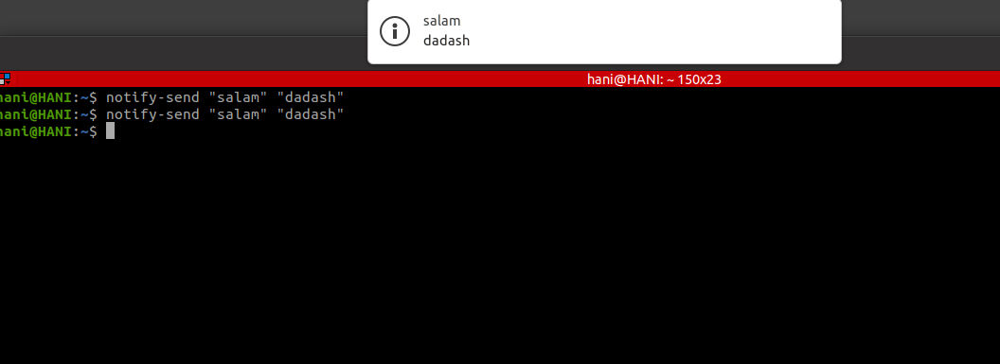

## 
 LPIC2 JADI ( Linux Professional Institute Certification ) 

## 
 **EXAM 201** 

# Table of Contents

1. [EPISODE 1](#EPISODE-1)
   
   1. [Introduction](#Introduction)

1. [EPISODE 2](#EPISODE-2)

   1. [Linux Boot](#Linux-Boot)

1. [EPISODE 3](#EPISODE-3)      

   1. [Boot Loaders](#Boot-Loaders)

1. [EPISODE 4](#EPISODE-4)

   1. [Init Concept](#Init-Concept)

1. [EPISODE 5](#EPISODE-5)

   1. [SysV](#SysV)

1. [EPISODE 6](#EPISODE-6) 

    1. [Systemd](#Systemd)
    2. [systemctl command](#systemctl)

2. [EPISODE 7](#EPISODE-7) 

    1. [Upstart and System Rescue](#Upstart-and-System-Rescue)

3. [EPISODE 8](#EPISODE-8) 

    1. [Informing](#Informing)

4. [EPISODE 9](#EPISODE-9) 

    1. [Backup](#Backup)
    2. [tar command](#tar)
    3. [rsync command](#rsync)
    4. [dd command](#dd)
1. [COMMAND LIST](#COMMAND-LIST) 

&nbsp;

&nbsp;

----------------------------------------------------------------------------------------------------------

## EPISODE 1 :  

----------------------------------------------------------------------------------------------------------

### 
 Introduction 

course instructor : [JADI](https://jadi.ir/).

source courses : [GO TO CLASS LPIC2](https://gotoclass.ir/courses/lpic-2/).

Source Book is linux professional institute certification : [LPIC2](https://gotoclass.ir/courses/lpic-2/).

جادی میرمیرانی برنامه‌نویس و دانشمند داده‌ای با بیش از بیست سال سابقه برنامه‌نویسی حرفه‌ای است که تجربه زیادی در زمینه تدریس در حوزه آی تی دارد. از مجموعه آموزش های پرطرفدار او میتوان به آموزش لینوکس اشاره کرد که در آن سرفصلهای lpic-1 را پوشش می‌دهد این دوره در وب‌سایت‌های مختلف با عنوان lpic جادی یا لینوکس جادی شناخته می‌شود. اما تدریسهای او به همین مورد محدود نمیشود. جادی علاوه بر این در وبسایت شخصی خود مجموعه‌ای از پادکستها و ویدیو کستها را برای علاقمندان به برنامه نویسی منتشر می‌کند و گاهگاهی دست به ترجمه کتابهای تخصصی می‌زند.

----------------------------------------------------------------------------------------------------------

##   EPISODE 2 :  

----------------------------------------------------------------------------------------------------------

### 
Linux Boot
 

دستور زیر نشان دهنده ی مراحل بوت کرنل می باشد :

> dmesg

انواع معماری های عمومی بوت :

1. BIOS
2. UEFI

 در BIOS بعد از عمل POST از یک سکتور هارد انتظار می رود سخت افزار را بوت کند (اولین سکتور از هارد را MBR یا Master Boot Recorde می گویند) بعد به وسیله برنامه کوچکی به نام  Boot Loader کرنل  اجرا می شود .

در UEFI نیاز به بوت لودر برای بوت کرنل نیست و میتوان از هر قسمت از هارد کرنل را اجرا و سیستم را بوت کرد همچنین می توان از بوت لودر هم در این معماری برای بوت سیستم استفاده کرد.  

----------------------------------------------------------------------------------------------------------

##   EPISODE 3 :  

----------------------------------------------------------------------------------------------------------

### 
 Boot Loaders 
 

 انواع  بوت لودر :

 
1.  LILO (Linux Loader)
1.  GRUB (Grand Unifide Boot Loader)
    1.  GRUB Legacy
    2.  GRUB 2

در حال حاضر LILO استفاده نمی شود .  
در بوت لودر های GRUB از UEFI  ساپورت می شود. فایل های کانفیگ گراب دو در مسیر زیر قرار دارد.  

    /boot/grub/grub.cfg

در فایل بالا میتوان تنظیمات مربوط به گراب دو را مشاهده کرد .  
<ins>لازم به ذکر است برای تغییر کانفیگ گراب نباید فایل بالا را ویرایش کنید.</ins>  
از طریق فایل های زیر می توان به صورت جداگانه تغییرات لازم را انجام داد. 

    /boot/grub/grub.cfg
    /etc/grub.d/*

از دستورات زیر می توان برای نصب گراب بر روی قسمت MBR  دیسک انجام داد.

> grub-install  

    grub-install /dev/sda

----------------------------------------------------------------------------------------------------------

##  EPISODE 4 : 

----------------------------------------------------------------------------------------------------------

### 
 Init Concept 

انواع سیستم ها برای init کردن پرسس ها عبارت اند از :

  
1. SysV
1. Systemd
1. Upstart
 

انواع Run Level ها : (ران لول ها می تواند شخصی سازی یا برای هر سیستم عامل متفاوت باشد و یا تعدادی از آن ها متفاوت نباشد و شبیه یک دیگر باشند)

1. LVL 0 (Shoutdown)
1. LVL 1 (Single User)
1. LVL 2 (GUI Multi User)
1. LVL 3 
1. LVL 4 
1. LVL 5 (GUI)
1. LVL 6 (Reboot)

برای دیدن ران لولی که در آن وجود داریم از دستور زیر استفاده می کنیم :

>runlevel

برای تغییر ران لول از دستور زیر استفاده می کنیم.

>init 5

دستوراتی که از ران لول ها استفاده می کنند :

> reboot  
> shoutdown  

hult mode 
> shoutdown -h 

power off
> shoutdown now 

----------------------------------------------------------------------------------------------------------

##  EPISODE 5 :

----------------------------------------------------------------------------------------------------------

### 
 SysV 

در سیستم های قدیمی که از Sys V استفاده میکنند فایل های کانفیگ مربوطه در ادرس های زیر موجود می باشد.  

    /etc/inittab
    /etc/init.d

در مسیر etc/init.d/ اسکریپت هایی برای stop, start, restart کردن سرویس ها وجود دارد. برای مثال :

    user@PC:~$ ls -l /etc/init.d/
    -rwxr-xr-x 1 root root 2269 Nov 28  2019 acpid
    -rwxr-xr-x 1 root root 5574 Nov  5  2019 alsa-utils
    -rwxr-xr-x 1 root root 2055 Jul 16  2019 anacron
    -rwxr-xr-x 1 root root 3740 Apr  1  2020 apparmor

----------------------------------------------------------------------------------------------------------

##  EPISODE 6 :

----------------------------------------------------------------------------------------------------------

### 
 Systemd 

سیستم دی با یک مفهوم بزرگ کار می کنه : 

1. UNIT 

هر unit از چه چیز هایی تشکیل می شود؟ name + type+config

هر type می تواند شامل : 

1. target
1. service
1. socket
1. path
1. mount
1. and .....

#### systemctl command

برای دیدن تمامی Unit ها از دستور زیر استفاده می کنیم :
> systemctl  

یا

> systemctl list-units

تمامی  UNIT ها در مسیر زیر تعریف شده اند :

    /lib/systemd/system

بخشی دیگری از تنظیمات در مسیر زیر قرار دارد : 

    /etc/systemd/system/

دستوراتی که می توان برای تغییر وضعیت unit  ها استفاده کرد :

> systemctl \[options] [unit name] 

نشان دادن وضعیت یونیت
> systemctl start forticlient-scheduler.service

استارت کردن یونیت
> systemctl start forticlient-scheduler.service  

استوپ کردن یونیت
> systemctl stop forticlient-scheduler.service  

قطع و وصل کردن یونیت
> systemctl restart forticlient-scheduler.service  

اگر سرویسی قابلیت reload شدن داشته باشه فایل کانفیگ را از اول می خواند اما اگر این قابلیت را نداشته باشد همانند restart سرویس را قطع و وصل می کند.

> systemctl reload forticlient-scheduler.service  

فعال کردن upstart
> systemctl enable forticlient-scheduler.service

غیر فعال کردن upstart
> systemctl disable forticlient-scheduler.service

قطع کردن تمام یونیت ها و وصل کردن یک یونیت خاص (برای ترابل شوت استفاده مب شود)
> systemctl isolate forticlient-scheduler.service

نشان دادن لاگ های یونیت ها
> journalctl

----------------------------------------------------------------------------------------------------------

## EPISODE 7 : 

----------------------------------------------------------------------------------------------------------

### 
 Upstart and System Rescue 
 

اپ استارت یک سیستم منسوخ شده همانند SysV می باشد که تنها فرق متمایز و جذاب آن وابسته نبودن به ران لول ها بود.

در زمانی که کرنل لینوکس ما آسیب دیده باشد در هنگام بوت می توانیم در گراب کرنل را تغییر دهیم و مراحل بوت را از  طریق کرنل دیگری بگذرانیم.

----------------------------------------------------------------------------------------------------------

##  EPISODE 8 : 

----------------------------------------------------------------------------------------------------------

### 
  Informing  

انواع اطلاع رسانی به یوزر ها :

1. Fluid
1. Static

در اطلاع رسانی fluid شما می توانید یک پیام را به همه یا یک نفر بفرستید. و در Static  همه یوزر ها می توانند چیزیکه نوشته اید را ببینند مانند زمانی که ssh به سروری میزنید و نوشته هایی برای شما نمایش داده می شود .  

 انواع اطلاع رسانی به روش Fluid :

برای دیدن وضعیت دریافت پیام و یا تغییر وضعیت از دستور زیر استفاده می کنیم.

نشان دادن وضعیت:

> mesg

تغیییر وضعیت برای عدم دریافت پیام :

> mesg n

تغیییر وضعیت برای  دریافت پیام :

> mesg y

 برای دیدن یوزر هایی که در سیستم لاگین هستن از دستور زیر استفاده می کنیم :

> who

برای نوشتن پیام برای همه از دستور زیر استفاده می کنیم : 

> wall 

    wall salam dadash

از دستور زیر برای فرستادن نوتیفیکیشن برای محیط های گرفیکی استفاده می کنیم : 

> notify-send "titel" "message"

     notify-send "salam" "dadash"

همچنین می توانیم  همراه با دستور shutdown پیامی به تمامی کاربران ارسال کنیم . مثال در پایین دستورات :

hult mode

> shoutdown -h

cancel shutdown process

> shoutdown -c

reboot mode

> shoutdown -r

power off mode

> shoutdown -p

no new login  after this command

> shoutdown -k

Do not send wall message before halt, power-off, reboot

> shoutdown --no-wall

    shutdown -h +5 "system is shoutdown after 5 minutes"

انواع اطلاع رسانی به روش Static :

در این روش می توانیم پیام هایی برای زمانی که هر یوزر به سیستم لاگین می کند نمایش دهیم.

برای کسانی که به صورت ریموت به سیستم لاگین می کنن با تغییر فایل زیر نمایش داده می شود (نیاز به کانفیگ فایل ssh هم دارد) 

    vi /etc/issue.net

برای کسانی که به صورت لوکالی لاگین می کنند نمایش  داده می شود.

    vi /etc/issue

پیام هایی که بعد از issue و issue.net می آید با تغییر فایل زیر می باشد. 

    vi /etc/motd
----------------------------------------------------------------------------------------------------------

##  EPISODE 9 : 

----------------------------------------------------------------------------------------------------------

### 
 Backup 

انواع backup : 

1. Full Backup
1. Incrimental
1. Diffrential
1. Snapshot

اسنپ شات یک نپع بک اپ تکه تکه می باشد که بعد از بک اپ اول تکه هایی که جدید می باشد و یا تکه های خراب را فقط در بک اپ دوم می گیرد

دستوراتی که برای بک اپ گیری می توان از آن ها استفاده کرد:

1. tar
1. rsync
1. dd

#### tar command

creat file and copy content from archive file  
c = creat file  
f = archive file
> tar cf /sample/new-file-created /sample/archive-file  

creat file and copy content from archive file and zip it.  
z = zip file (gzip protocol)  
j = zip file (bzip2 protocol)

> tar czf /sample/new-file-created /sample/archive-file

t = show list of content on the tar file

> tar tf /sample/archive-file  

u = update tar file (importent)  
v = verbos  

برای اپدیت فایل بکاپ قدیمی استفاده می شود که چک می کند فایل ارشیو قدیمی را اگر چیزی جدید اضافه شده بود فقط ان را اضافه می کند.

> tar ufv /sample/old-backup /sample/archive-file

#### rsync command

v = verbos  
h = human readable  
a = archive (تکراری هارو کپی نمی کند)  
> rsync -avh /tmp/source /tmp/destinaton

remote feature

rsync -avh /tmp/source username@ip:/sample/destination

#### dd command

if = input file  
of = output file

> dd if=/sample/source of=/sample/destination

bs =  block size

> dd if=/sample/source of=/sample/destination bs=4M

# COMMAND LIST

> dmesg    
> grub-install    
> runlevel  
> init 5  
> reboot    
> shoutdown    
> shoutdown -h   
> shoutdown now   
> systemctl    
> systemctl list-units  
> systemctl \[options] [unit name]   
> systemctl start forticlient-scheduler.service  
> systemctl start forticlient-scheduler.service    
> systemctl stop forticlient-scheduler.service    
> systemctl restart forticlient-scheduler.service    
> systemctl reload forticlient-scheduler.service    
> systemctl enable forticlient-scheduler.service  
> systemctl disable forticlient-scheduler.service  
> systemctl isolate forticlient-scheduler.service  
> journalctl  
> mesg  
> mesg n  
> mesg y  
> who  
> wall   
> notify-send "titel" "message"  
> shoutdown -h  
> shoutdown -c  
> shoutdown -r  
> shoutdown -p  
> shoutdown -k  
> shoutdown --no-wall  
> tar cf /sample/new-file-created /sample/archive-file    
> tar czf /sample/new-file-created /sample/archive-file  
> tar tf /sample/archive-file    
> tar ufv /sample/old-backup /sample/archive-file  
> rsync -avh /tmp/source /tmp/destinaton  
> dd if=/sample/source of=/sample/destination  
> dd if=/sample/source of=/sample/destination bs=4M  

